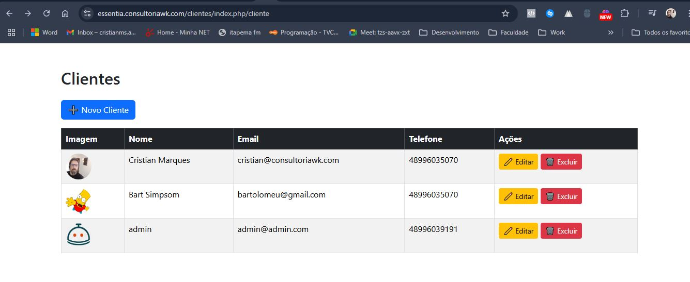

# Sistema de Cadastro de Clientes - PHP MVC (CodeIgniter 3)

Este projeto é uma versao atualizada e melhorada do sistema simples de gerenciamento de clientes com endereço vinculado, implementado em **CodeIgniter 3**. A estrutura adotada mistura o padrão MVC tradicional do CI com uma organização *DDD-like* (camadas `domain` / `infrastructure` / `usecases`) para isolar regras de negócio e tornar o código testável e mais manutenível e com Test-Driven Development (TDD) com PHPUnit e melhorias para seguir princípios SOLID.

---

## ✅ Funcionalidades

* Listagem de clientes (com miniatura da imagem)
* Cadastro de clientes com upload de foto
* Edição de cliente (dados + endereço)
* Exclusão de cliente (propaga remoção do endereço)
* Validações de formulário (nome, email, telefone)
* Integração com API de CEP (ViaCEP) via serviço
* Estrutura preparada para DDD: `domain`, `infrastructure`, `usecases`
* Testes unitários (PHPUnit) cobrindo criação, edição e exclusão de cliente
* Injeção de dependências nos serviços/repos (facilita testes e mantém SOLID)
---

## ⚙️ Requisitos

* PHP 8.0+ (versões compatíveis com CodeIgniter 3)
* MySQL / MariaDB
* XAMPP / MAMP / WAMP / LAMP (ou servidor equivalente)
* Composer (necessário para PHPUnit)
* Pastas do projeto dentro do `htdocs`/`www` do servidor

---

## 🗂️ Estrutura do projeto (como está no repositório)

```
clientes/
├── app/                                    # novo - PSR-4 (modelos/adapters modernos) 
│   ├── Models/ 
|   ├── Repositories/ 
│   └── Services/
|
├── application/
│   ├── config/
│   ├── controllers/
│   │   └── Cliente.php
│   ├── domain/
│   │   ├── entities/
│   │   │   └── ClienteEntity.php
│   │   └── services/
│   │       └── ClienteService.php         # regras de negócio
│   ├── helpers/
│   │   └── ddd_autoload_helper.php        # autoload das classes DDD
│   ├── infrastructure/
│   │   ├── repositories/
│   │   │   ├── ClienteRepository.php
│   │   │   └── CepRepository.php
│   │   └── services/
│   │       ├── CepService.php             # consulta ViaCEP + cache DB
│   │       └── ClienteService.php         # adapter para CI/Model
│   ├── libraries/
│   │   └── Curl.php
│   ├── models/
│   │   ├── ClienteModel.php
│   │   └── CepModel.php
│   ├── usecases/
│   │   └── CadastrarCliente.php
│   └── views/
│       └── clientes/
│           ├── index.php
│           ├── create.php
│           └── edit.php
├── tests/                                  # testes PHPUnit
│   └── ClienteEntityTest.php
├── uploads/                                # imagens enviadas
├── database/
│   └── clientes.sql
├── bootstrap.php                           # inicialização para PHPUnit
├── phpunit.xml                             # configuração de testes
└── system/ (CodeIgniter core)

```

> Observação: o `domain` guarda entidade e regras; `infrastructure` concentra os adaptadores (modelos/serviços que conversam com CI e o banco). O helper `ddd_autoload_helper.php` facilita carregar classes por convenção (não obrigatório — pode ser mantido conforme o projeto).

---

## 🔧 Banco de Dados — esquema mínimo esperado

Se preferir, importe o `database/clientes.sql`. Abaixo o SQL mínimo para criar as tabelas usadas (ajuste nomes/colunas conforme necessidade):

```sql
CREATE TABLE `clientes` (
  `id` INT NOT NULL AUTO_INCREMENT PRIMARY KEY,
  `nome` VARCHAR(150) NOT NULL,
  `email` VARCHAR(150) NOT NULL,
  `telefone` VARCHAR(20) NOT NULL,
  `imagem` VARCHAR(255) DEFAULT NULL,
  `created_at` TIMESTAMP DEFAULT CURRENT_TIMESTAMP
) ENGINE=InnoDB DEFAULT CHARSET=utf8mb4;

CREATE TABLE `endereco` (
  `id` INT NOT NULL AUTO_INCREMENT PRIMARY KEY,
  `id_cliente` INT NOT NULL,
  `cep` VARCHAR(10) DEFAULT NULL,
  `logradouro` VARCHAR(150) DEFAULT NULL,
  `numero` VARCHAR(20) DEFAULT NULL,
  `complemento` VARCHAR(150) DEFAULT NULL,
  `bairro` VARCHAR(100) DEFAULT NULL,
  `localidade` VARCHAR(100) DEFAULT NULL,
  `uf` VARCHAR(2) DEFAULT NULL,
  `ibge` VARCHAR(20) DEFAULT NULL,
  `gia` VARCHAR(20) DEFAULT NULL,
  CONSTRAINT `fk_endereco_cliente` FOREIGN KEY (`id_cliente`) REFERENCES `clientes`(`id`) ON DELETE CASCADE
) ENGINE=InnoDB DEFAULT CHARSET=utf8mb4;

```
## 🧪 Testes (TDD)

* Este projeto utiliza PHPUnit para testes automatizados.


1. Instalação
  composer install


2. Arquivo bootstrap.php


Criado um arquivo bootstrap.php para contornar o No direct script access allowed do CodeIgniter nos testes:


  <?php
  if (!defined('BASEPATH')) {
      define('BASEPATH', __DIR__);
  }
  if (!defined('APPPATH')) {
      define('APPPATH', __DIR__ . '/application/');
  }
  require __DIR__ . '/vendor/autoload.php';


3. Executar testes

  php vendor/bin/phpunit --testdox


4. Exemplo de saída

  PHPUnit 9.6.29 by Sebastian Bergmann and contributors.


  * Cliente Entity
  ✔ Deve criar cliente com dados validos
  ✔ Deve editar cliente
  ✔ Deve excluir cliente

  Time: 00:00.015, Memory: 6.00 MB

  OK (3 tests, 6 assertions)


## 🔎 Debug — problemas comuns


  "No direct script access allowed"
  * Resolvido pelo bootstrap.php com as constantes BASEPATH e APPPATH.


  Imagem não aparece
  * Verifique se o arquivo existe em uploads/ e se base_url está correto.


  Tabela enderecos não encontrada
  * Corrigido: agora a tabela correta é endereco (singular).


  Sessão indefinida ($this->session)
  * IGaranta que a lib session está no autoload.


## 🔧 Regras SOLID aplicadas (resumo prático)


S (Single Responsibility)

Cada classe/arquivo tem uma responsabilidade única: ClienteModel (acesso ao DB), CepService (consulta de CEP e cache), ClienteService (regras de atualização e coordenação).

* O (Open/Closed)

Serviços e repositórios estruturados por interface (ex.: ClienteRepositoryInterface) permitem adicionar novos repositórios (MySQL / InMemory) sem alterar consumidores.

* L (Liskov Substitution)

Implementações de repositórios seguem a interface; podemos trocar ClienteRepositoryMysql por ClienteRepositoryInMemory nos testes sem quebrar o código.

* I (Interface Segregation)

Interfaces pequenas e focadas (apenas métodos necessários por consumidor).

* D (Dependency Inversion)

Controllers e services dependem de abstrações (interfaces) e recebem implementações via injeção (manual nos controllers ou via helper de autoload).


## 🧠 Observações

  * Projeto em CodeIgniter 3, atualizado para suportar práticas modernas de SOLID e DDD + TDD.

  * Arquitetura mais limpa e testável.

  * Ideal para avaliação de desenvolvedor backend full stack.


## ✍️ Autor

  Desenvolvido por Cristian Marques — https://wk.consultoriawk.com/

  Projeto adaptado para DDD-like com separação clara entre domain, infrastructure e testes unitários.

  


